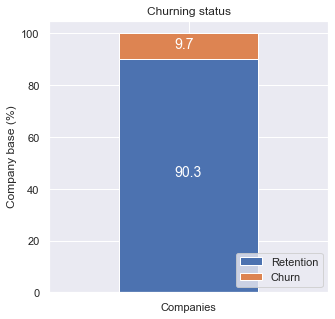
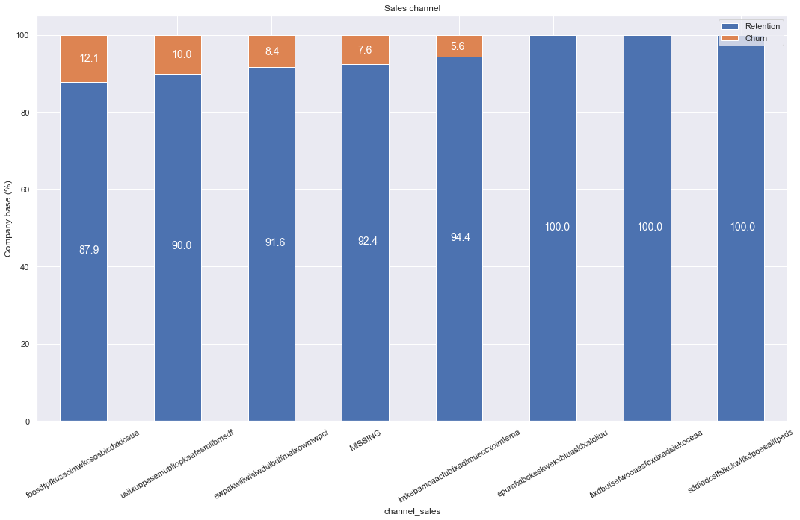
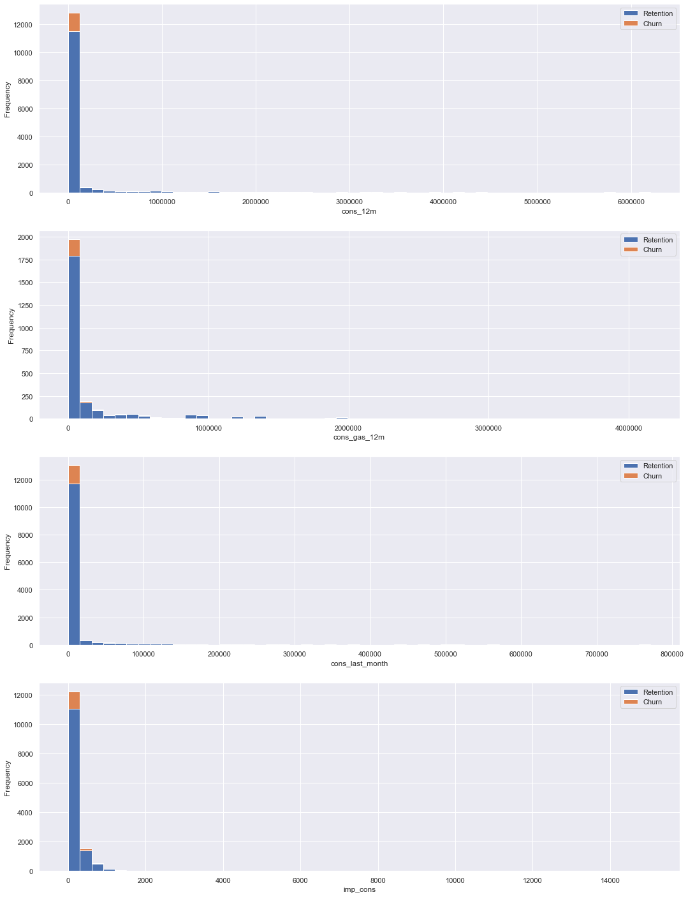
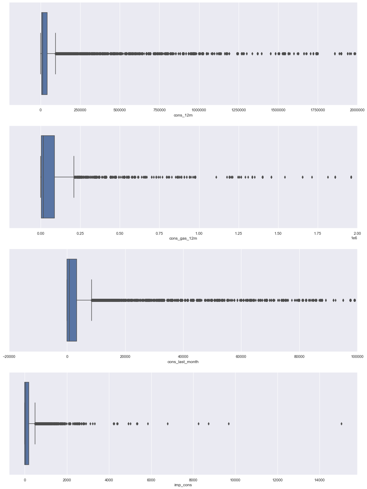

## 📊 Task 3: Exploratory Data Analysis & Data Cleaning

## Overview

This project was completed as part of the **BCG X Data Science Job Simulation** on **Forage**.

The objective was to explore, clean, and understand the datasets provided by PowerCo — analyzing customer, pricing, and churn data using Python to uncover early patterns related to churn, ahead of feature engineering and modeling.

---

## Business Scenario

Having framed customer churn as a potential price-sensitivity problem in Task 2, the next step was to get hands-on with PowerCo's data: understand what each dataset contains, clean it up where needed, and see whether any early patterns point toward what's driving churn.

---

## Datasets

- **`client_data.csv`** — Customer-level data: consumption, contract dates, forecasted usage, pricing forecasts, margins, and churn status
- **`price_data.csv`** — Historical variable and fixed energy pricing by customer and date
- **`Data_Description.pdf`** — Column-level definitions for both datasets

---

## Tools Used

- Python (pandas, matplotlib, seaborn)
- Jupyter Notebook
- Descriptive statistics
- Data visualization

---

## Approach

### 1. Understand the Data

- Reviewed column data types against the data description document to confirm they matched what each column represented
- Checked dataset shape, missing values, and unique value counts per column

### 2. Data Cleaning

- Converted date columns (contract activation, renewal, end, and last modification dates) to proper datetime format
- Checked for and handled missing values across both datasets
- Verified categorical columns (e.g. sales channel, origin of contract) for inconsistent or placeholder values

### 3. Descriptive Statistics

- Generated summary statistics (mean, median, min/max, standard deviation) for numerical columns
- Used unique value counts to understand categorical columns

### 4. Churn Overview

- Calculated the overall churn rate: **~9.7%** of customers churned
- Visualized churn against categorical features — sales channel, contract type, number of products, customer tenure (years), and origin of contract — to spot early relationships with churn

### 5. Distribution & Outlier Analysis

- Plotted distributions for key numerical columns (consumption, subscribed power, forecasted consumption)
- Identified strong **positive skew** in consumption-related columns, flagging them for transformation during feature engineering
- Used boxplots to detect outliers in consumption data, flagging them for potential treatment later

---

## Key Findings

- **Churn rate is ~9.7%** across the customer base — a relatively low churn rate overall
- **Sales channel** shows some variation in churn — a few channels account for most churned customers, while others show almost none
- **Contract type** shows a fairly even split between churned and retained customers, suggesting it's not a strong standalone driver of churn
- **Consumption columns are heavily right-skewed**, with clear outliers visible in boxplots — both flagged for treatment in the feature engineering stage

---

## Key Visualizations

---

## Key Skills Demonstrated

- Data cleaning and validation
- Exploratory data analysis (EDA)
- Descriptive statistics
- Data visualization (distribution plots, boxplots, categorical breakdowns)
- Outlier and skew detection
- Translating visual patterns into business-relevant observations

---

## Deliverables

- [`client_data.csv`](./client_data.csv) — customer dataset
- [`price_data.csv`](./price_data.csv) — pricing dataset
- [`Data_Description.pdf`](./Data_Description.pdf) — column definitions
- [`eda_starter.ipynb`](./eda_starter.ipynb) — starter notebook template
- [`EDA_Answer.ipynb`](./EDA_Answer.ipynb) — completed exploratory data analysis and data cleaning

---

## Learning Outcomes

Through this task, I gained hands-on experience with:

- Building a repeatable framework for exploring and cleaning an unfamiliar dataset
- Using descriptive statistics and visualizations together to understand data quality and structure
- Spotting skew and outliers early, and understanding why they matter for later modeling
- Connecting exploratory findings back to the original business hypothesis (price sensitivity and churn)
